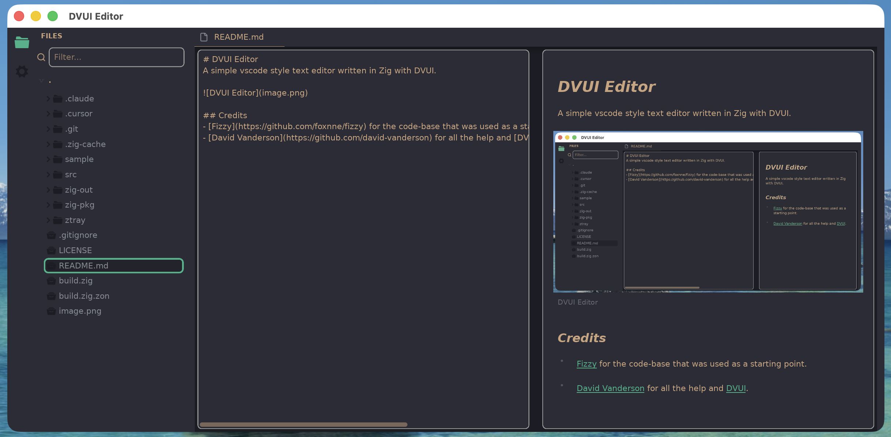
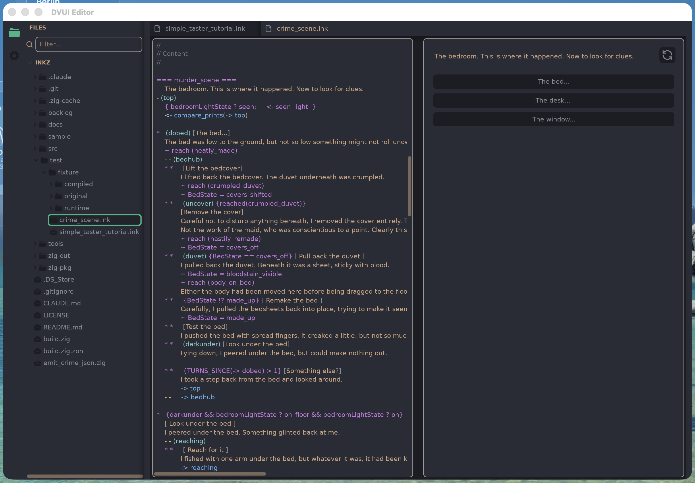

# DVUI Editor
A simple vscode style text editor written in Zig with DVUI.

## Credits
- [Fizzy](https://github.com/foxnne/fizzy) for the code-base that was used as a starting point.
- [David Vanderson](https://github.com/david-vanderson) for all the help and [DVUI](https://github.com/david-vanderson/dvui).